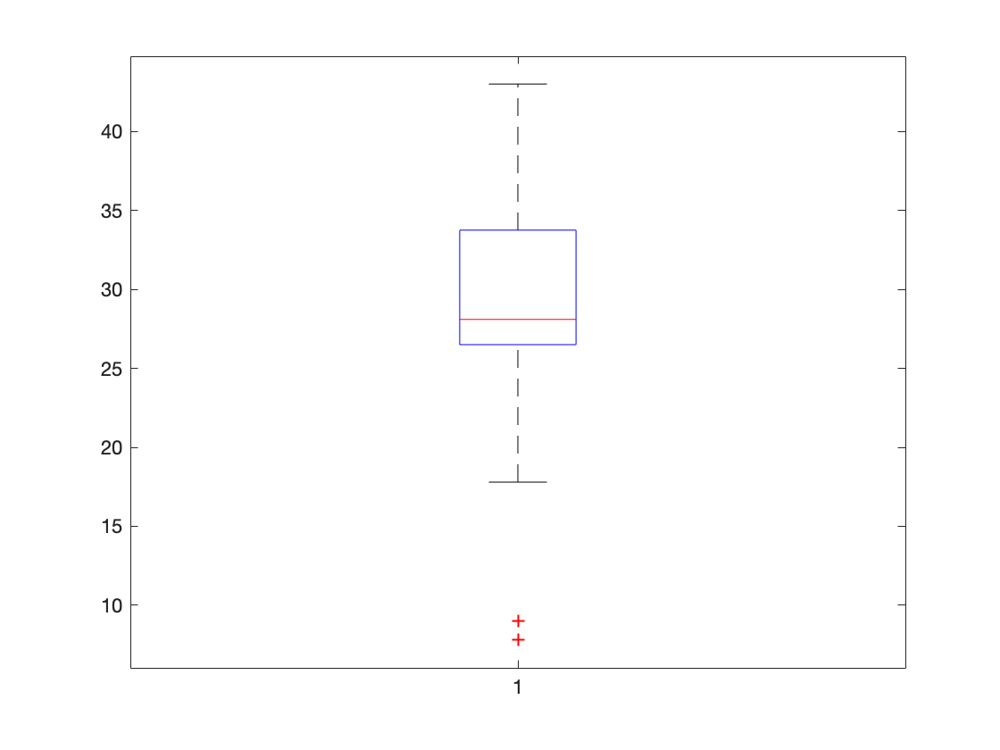

# Homework1

### 计63班 肖朝军 2016011302

#### 一、数据属性类型练习

* 教师的职称

  **Ordinal**：教师的职称是categories，并且职称之间有明显的大小关系

* 手机号

  **Nominal**：手机号是categories，并且没有大小序列关系

* 体重

  **Ration**：体重是一个数值，且0是有意义的

* 出生日期

  **Interval**：出生日期是数值，但是没有0这个概念，或者说0对于出生日期来说没有意义

* 出生地

  **Nominal**：出生地是categories，且不同出生地没有顺序、大小关系

* 年龄

  **Ratio**：年龄是数值，且0有意义

#### 二、计算统计信息

* 计算这组数据的均值、中位数和众数

  均值：28.02

  中位数：27.4

  众数：26.5 出现了三次

* 五数概括法，并画盒图

  **Min**：7.8

  **1st Qu**：26.5

  **Median**：27.4

  **3rd Qu**：33.4

  **Max**：43.0

  盒图如下：

   

#### 三、 文本的数据表示

* 文档的表示

  实现思路：

  * 词典构建：利用正则表达式 `[^a-zA-Z]`将标点符号删除，将所有字母转换成小写并删除停用词。利用所给语料库中所有词语构造词典。

    > 代码中函数
    >
    > * **to_word_list(doc)**：将文档中标点删除，转成小写，删除停用词，转成词语列表
    > * **cal_idf(corpus)**：遍历所有文档，构造词典（_word2id_）计算各个词语的IDF值（_idf_）

  * 利用TF-IDF公式计算各个词语的IDF值，并将所有文章一一转成TF-IDF向量。

    > 代码中函数
    >
    > * **tfidf(doc, idf, word2id)**：将一篇文档转成tfidf向量

* 词语的表示

  实现思路：

  * 词典构造：利用上面文档表示中构造的词典

  * 计算共现矩阵C：遍历每一篇文档，并在每一篇文档中遍历所有词语，若$word_{i}$与$word_{j}$共同出现在文档中，则C(i, j) += 1。最后用numpy来表示词语向量。

    > 注：按照实验作业说明中实现，也就是说计算共现向量忽略了窗口大小，即窗口无限大。

  

* 文档距离计算与分析

  选取第10篇文章：该文章讲述了联合国秘书长潘基文要求美国总统布什取消维和开支上限的新闻

  * 余弦相似度高的5篇文章

    * 第110篇：讲述了联合国秘书长潘基文任命了两名发展中国家的女性担任联合国副秘书长的新闻

      > 与第10篇文章都以联合国秘书长为主角，都为政治性新闻

    * 第241篇：讲述美国联邦劳工部报道了自Edward I.Koch担任市长以来，去年纽约大都会区盖屋顶的成本上涨速度最快。

      > 与第10篇文章都涉及了美国、开支等信息

    * 第119篇：布什总统任命一个极端的政治党派为阿肯色州的新美国律师

      > 都涉及了总统布什，美国政府

    * 第282篇：纽约市失业率创30年来最低水平

      > 涉及percent、经济等信息

    * 第277篇：美国最大的经纪公司美林第四季度利润增长68%，为主要经纪公司创下了创纪录的盈利季节。

      > 涉及美国、经济、percent等信息

    > 由此可以看出余弦相似度找出的文章都是关于经济、美国、政治等的信息，有较好的相关性

  * 欧氏距离最短的5篇文章

    * 第256篇：节目预告
    * 第52篇：节目预告
    * 第119篇：见上
    * 第258篇：节目预告
    * 第31篇：节目预告

    > 由此可知欧式距离计算出的几篇文章与第10篇文章没有太大的关系

* 词语距离计算与分析

  选取了money作为基本单词

  * 余弦相似度
    * myspace
    * think
    * year
    * last
    * back
  * 欧式距离短
    * although
    * put
    * force
    * used
    * every

  > 可以看出这些词语和money没有太多的关系，原因可能是在没有限定共现窗口的大小情况下，共现情况有较大噪音，造成大部分词语的共现矩阵无太多关系；或者是因为文档数量太少，词语数量比文档数量大几个量级，因此统计信息无法捕获到很好的相关信息。